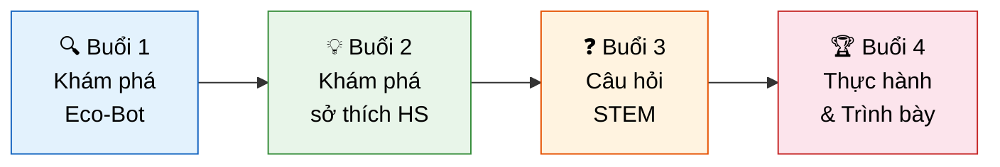
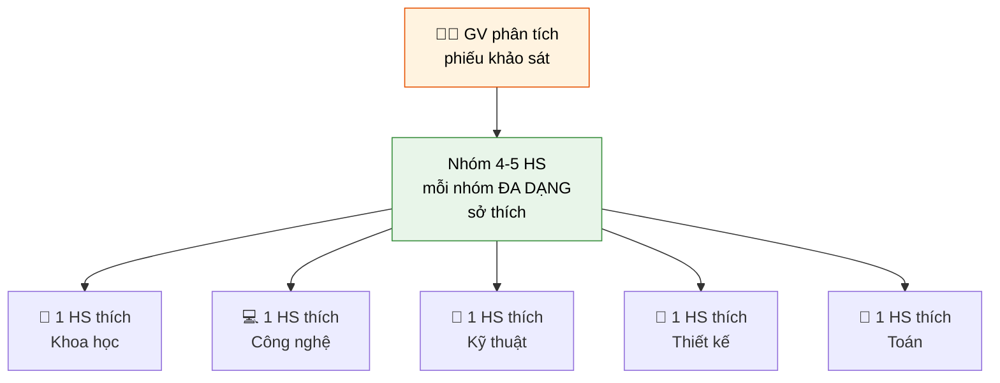

# 🤖 KẾ HOẠCH DẠY STEM LỚP 6 — DỰ ÁN ECO-BOT

> **Chủ đề**: Robot nông nghiệp thông minh Eco-Bot
> **Đối tượng**: Học sinh lớp 6
> **Thời lượng**: 4 buổi (mỗi buổi 90 phút)
> **Phương pháp**: STEM tích hợp + Học qua dự án (PBL)

---

## 📋 TỔNG QUAN LỘ TRÌNH



---

## 🔍 BUỔI 1: KHÁM PHÁ ECO-BOT (90 phút)

### Mục tiêu
- HS hiểu được khái niệm "Robot nông nghiệp thông minh"
- HS nhận diện được các bộ phận của Eco-Bot và chức năng tương ứng
- HS liên hệ được kiến thức STEM trong từng bộ phận

### Hoạt động

#### ⏱️ Phần 1 — Khởi động (15 phút)
**"Nếu em là nông dân tương lai..."**

| Bước | Nội dung | Thời gian |
|------|----------|-----------|
| 1 | GV chiếu hình ảnh nông nghiệp truyền thống vs. hiện đại | 3 phút |
| 2 | HS thảo luận nhóm đôi: "Nông dân gặp khó khăn gì?" | 5 phút |
| 3 | Các nhóm chia sẻ → GV ghi bảng | 5 phút |
| 4 | GV đặt câu hỏi: "Nếu có 1 robot giúp nông dân, em muốn nó làm gì?" | 2 phút |

#### ⏱️ Phần 2 — Khám phá Eco-Bot (35 phút)

> [!TIP]
> Sử dụng mô hình 3D tương tác (`07_EcoBot_3D_TuongTac.html`) chiếu lên máy chiếu, cho HS xoay và khám phá trực tiếp.

**Hoạt động "Thám tử Eco-Bot"** — Chia lớp thành 6 nhóm, mỗi nhóm nhận 1 phiếu khám phá:

| Nhóm | Bộ phận nghiên cứu | Câu hỏi dẫn dắt |
|------|---------------------|------------------|
| 🟫 Nhóm 1 | Thân robot (bìa cát tông) | Tại sao chọn hình hộp? Vật liệu nào thay thế được? |
| 🌱 Nhóm 2 | Mái vòm + cây trồng | Cây cần gì để sống? Đèn LED giúp gì? |
| ⚙️ Nhóm 3 | Bánh xích di chuyển | Tại sao dùng xích thay vì bánh xe tròn? |
| ☀️ Nhóm 4 | Pin mặt trời | Năng lượng mặt trời chuyển thành gì? |
| 💧 Nhóm 5 | Cánh tay tưới nước | Làm sao robot biết khi nào cần tưới? |
| 🌡️ Nhóm 6 | Cảm biến độ ẩm | Cảm biến hoạt động như thế nào? |

**Quy trình:**
1. Mỗi nhóm quan sát mô hình 3D (xoay đến góc nhìn phù hợp) — 5 phút
2. Xem ảnh chi tiết các góc nhìn (6 ảnh đã tạo) — 5 phút
3. Thảo luận và điền phiếu khám phá — 10 phút
4. Trình bày trước lớp (mỗi nhóm 2-3 phút) — 15 phút

#### ⏱️ Phần 3 — Kết nối STEM (25 phút)

GV hướng dẫn HS điền **Bản đồ STEM của Eco-Bot**:

```
┌──────────────────────────────────────────────────────────┐
│                    🤖 ECO-BOT                            │
├──────────────┬──────────────┬──────────────┬─────────────┤
│  🔬 SCIENCE  │  💻 TECH     │  🔧 ENGINE   │  📐 MATH   │
├──────────────┼──────────────┼──────────────┼─────────────┤
│ • Quang hợp  │ • Cảm biến  │ • Bánh xích  │ • Tính diện │
│ • Độ ẩm đất  │ • LED       │ • Cánh tay   │   tích tưới │
│ • Ánh sáng   │ • Pin mặt   │   cơ khí     │ • Tỉ lệ    │
│   đỏ/xanh    │   trời      │ • Kết cấu    │   nước/đất  │
│ • Dinh dưỡng │ • Arduino   │   thân       │ • Góc xoay  │
│   cây trồng  │   (vi điều  │ • Vòi tưới   │   cánh tay  │
│              │   khiển)     │ • Gieo hạt   │ • Thể tích  │
│              │              │              │   mái vòm   │
└──────────────┴──────────────┴──────────────┴─────────────┘
```

#### ⏱️ Phần 4 — Phản hồi & Tổng kết (15 phút)
- HS viết **1 điều đã học** + **1 câu hỏi còn thắc mắc** vào giấy note
- GV thu thập và phân loại câu hỏi → dùng cho Buổi 3

---

## 💡 BUỔI 2: KHÁM PHÁ SỞ THÍCH CỦA TỪNG EM (90 phút)

### Mục tiêu
- HS tự nhận biết sở thích và thế mạnh STEM của bản thân
- GV nắm được profile sở thích của từng HS để phân nhóm dự án
- HS thấy mình trong STEM (ai cũng có vai trò)

### Hoạt động

#### ⏱️ Phần 1 — Phiếu khảo sát sở thích STEM (20 phút)

> [!IMPORTANT]
> Mỗi HS làm phiếu cá nhân, KHÔNG bàn bạc. Không có đáp án đúng/sai.

**📝 PHIẾU KHẢO SÁT SỞ THÍCH STEM**

**Họ tên: _________________ Lớp: _______**

**Phần A — Em thích hoạt động nào nhất? (Khoanh tròn 1-5 sao)**

| # | Hoạt động | ⭐ Mức thích |
|---|-----------|-------------|
| 1 | Quan sát côn trùng, cây cối, thí nghiệm hóa học | ☆☆☆☆☆ |
| 2 | Dùng máy tính, lập trình, tìm hiểu app mới | ☆☆☆☆☆ |
| 3 | Lắp ráp đồ chơi, xây mô hình, sửa đồ điện | ☆☆☆☆☆ |
| 4 | Giải toán, đo đạc, tính toán, vẽ hình học | ☆☆☆☆☆ |
| 5 | Vẽ tranh, thiết kế, trang trí, làm thủ công | ☆☆☆☆☆ |
| 6 | Thuyết trình, kể chuyện, thuyết phục người khác | ☆☆☆☆☆ |
| 7 | Làm việc nhóm, tổ chức, phân công công việc | ☆☆☆☆☆ |
| 8 | Trồng cây, chăm sóc vườn, bảo vệ môi trường | ☆☆☆☆☆ |

**Phần B — Nếu làm dự án Eco-Bot, em muốn đảm nhận vai trò nào?**

| Vai trò | Mô tả | ✅ Chọn |
|---------|--------|---------|
| 🔬 Nhà Khoa học | Nghiên cứu cây trồng, đất, nước, ánh sáng | ☐ |
| 💻 Kỹ sư Công nghệ | Lập trình, kết nối cảm biến, LED | ☐ |
| 🔧 Kỹ sư Cơ khí | Thiết kế, lắp ráp thân robot, cánh tay | ☐ |
| 🎨 Nhà Thiết kế | Trang trí, vẽ sơ đồ, làm poster | ☐ |
| 📊 Nhà Toán học | Tính toán kích thước, lượng nước, thời gian | ☐ |
| 🎤 Người thuyết trình | Trình bày dự án, viết báo cáo | ☐ |

**Phần C — Câu hỏi mở**
1. *Nếu được cải tiến Eco-Bot, em sẽ thêm tính năng gì?*
   _______________________________________________
2. *Vấn đề nào ở quê/nhà em mà robot có thể giúp giải quyết?*
   _______________________________________________

---

#### ⏱️ Phần 2 — Trò chơi "STEM Corners" (25 phút)

**Cách chơi:**
1. GV dán 4 góc phòng: 🔬 **Khoa học** | 💻 **Công nghệ** | 🔧 **Kỹ thuật** | 📐 **Toán học**
2. GV đọc từng tình huống → HS di chuyển đến góc mà em nghĩ phù hợp nhất
3. Tại mỗi góc, HS giải thích lý do chọn

**Các tình huống:**

| # | Tình huống | Góc đúng (tham khảo) |
|---|-----------|---------------------|
| 1 | "Eco-Bot cần biết khi nào đất khô để tưới" | 🔬 + 💻 |
| 2 | "Eco-Bot cần leo qua luống đất mà không đè cây" | 🔧 |
| 3 | "Eco-Bot cần tính bao nhiêu nước cho 1 luống rau" | 📐 |
| 4 | "Eco-Bot cần đèn LED đúng màu để cây quang hợp" | 🔬 |
| 5 | "Eco-Bot cần lập trình để tự di chuyển theo hàng" | 💻 |
| 6 | "Eco-Bot cần thiết kế cánh tay gập lại khi không dùng" | 🔧 + 📐 |
| 7 | "Eco-Bot cần pin mặt trời đủ lớn để chạy cả ngày" | 🔬 + 📐 |
| 8 | "Eco-Bot cần gửi dữ liệu về điện thoại nông dân" | 💻 |

> [!NOTE]
> Nhiều tình huống thuộc 2-3 góc → đây là cơ hội GV giải thích STEM là "tích hợp", không tách rời!

---

#### ⏱️ Phần 3 — Phân nhóm theo sở thích (25 phút)

GV dựa vào phiếu khảo sát để phân nhóm **đa dạng sở thích**:



**Mỗi nhóm thực hiện:**
1. Đặt tên nhóm (liên quan nông nghiệp/robot)
2. Phân vai trò cho từng thành viên
3. Vẽ sơ đồ "Eco-Bot phiên bản của nhóm em" (thêm 1 tính năng mới)

#### ⏱️ Phần 4 — Chia sẻ & Kết thúc (20 phút)
- Mỗi nhóm trình bày ý tưởng Eco-Bot cải tiến (2 phút/nhóm)
- GV tổng hợp: "Mỗi em đều có thế mạnh riêng, STEM cần TẤT CẢ!"

---

## ❓ BUỔI 3: CÂU HỎI STEM TÍCH HỢP (90 phút)

### Mục tiêu
- HS vận dụng kiến thức liên môn để trả lời câu hỏi thực tế
- HS phát triển tư duy phản biện và giải quyết vấn đề
- HS chuẩn bị nền tảng cho buổi thực hành

---

### 🔬 CÂU HỎI KHOA HỌC (SCIENCE)

#### Mức 1 — Nhận biết
> **S1.** Cây trồng trong mái vòm Eco-Bot cần những yếu tố nào để quang hợp?
>
> **S2.** Tại sao Eco-Bot dùng đèn LED **đỏ** và **xanh dương** thay vì đèn trắng thường?

#### Mức 2 — Thông hiểu
> **S3.** Nếu cảm biến đo độ ẩm đất = 20% (khô), Eco-Bot nên làm gì? Nếu = 80% (ướt) thì sao?
>
> **S4.** Giải thích tại sao cây trong mái vòm kín vẫn sống được dù không có gió tự nhiên?

#### Mức 3 — Vận dụng
> **S5.** Nếu Eco-Bot hoạt động trong nhà kính không có ánh sáng mặt trời, em cần thay đổi gì ở hệ thống đèn LED?
>
> **S6.** 🧪 *Thí nghiệm nhỏ*: Cho HS so sánh 2 cây — 1 cây dưới đèn LED đỏ+xanh, 1 cây dưới đèn trắng. Dự đoán kết quả sau 1 tuần?

---

### 💻 CÂU HỎI CÔNG NGHỆ (TECHNOLOGY)

#### Mức 1 — Nhận biết
> **T1.** Kể tên 3 loại cảm biến mà Eco-Bot có thể sử dụng.
>
> **T2.** Pin mặt trời trên vai Eco-Bot chuyển đổi năng lượng gì thành năng lượng gì?

#### Mức 2 — Thông hiểu
> **T3.** Nếu trời mưa 3 ngày liên tục, pin mặt trời không sạc được. Em đề xuất giải pháp năng lượng dự phòng nào?
>
> **T4.** Eco-Bot dùng cảm biến ẩm để đo độ ẩm đất. Ngoài ra, em nghĩ robot cần thêm cảm biến nào? Tại sao?

#### Mức 3 — Vận dụng
> **T5.** Thiết kế sơ đồ khối đơn giản: Cảm biến → Bộ xử lý → Hành động. Ví dụ: Cảm biến ẩm đo đất khô → Arduino xử lý → Bật vòi tưới.
>
> **T6.** Nếu muốn Eco-Bot gửi thông báo về điện thoại nông dân khi phát hiện sâu bệnh, em cần thêm công nghệ gì?

---

### 🔧 CÂU HỎI KỸ THUẬT (ENGINEERING)

#### Mức 1 — Nhận biết
> **E1.** Tại sao Eco-Bot dùng **bánh xích** thay vì **bánh xe tròn** để di chuyển trên đất nông nghiệp?
>
> **E2.** Cánh tay tưới nước của Eco-Bot được làm từ những vật liệu đơn giản nào?

#### Mức 2 — Thông hiểu
> **E3.** Nếu Eco-Bot quá nặng và đè lún đất trồng, em sẽ cải tiến phần nào của robot?
>
> **E4.** Mái vòm hình bán cầu và mái vòm hình hộp — cái nào chịu lực tốt hơn? Tại sao Eco-Bot chọn hình bán cầu?

#### Mức 3 — Vận dụng
> **E5.** 🔨 *Thử thách kỹ thuật*: Dùng 5 ống hút + băng keo + 1 cái cốc nhựa, thiết kế một cánh tay robot có thể gắp 1 viên bi. Nhóm nào gắp được nhiều bi nhất trong 30 giây thắng!
>
> **E6.** Vẽ bản thiết kế cải tiến cho Eco-Bot để nó có thể hoạt động trên cả ruộng lúa nước (đất ngập nước).

---

### 📐 CÂU HỎI TOÁN HỌC (MATH)

#### Mức 1 — Nhận biết
> **M1.** Mái vòm Eco-Bot hình bán cầu có bán kính 10cm. Tính diện tích đáy tròn chứa đất.
> *Gợi ý: S = π × r² ≈ 3.14 × 10² = ?*
>
> **M2.** Eco-Bot tưới mỗi cây 50ml nước. Luống rau có 12 cây. Hỏi cần bao nhiêu ml nước cho 1 luống?

#### Mức 2 — Thông hiểu
> **M3.** Pin mặt trời Eco-Bot tạo ra 5V điện. Đèn LED cần 2V, cảm biến cần 3V. Hỏi tổng điện áp cần dùng? Pin có đủ cung cấp không?
>
> **M4.** Eco-Bot di chuyển 0.5m trong 10 giây. Luống rau dài 3m. Hỏi robot mất bao lâu để đi hết 1 luống?

#### Mức 3 — Vận dụng
> **M5.** Eco-Bot cần tưới 4 luống rau, mỗi luống 12 cây, mỗi cây 50ml. Bình nước chứa 3 lít. Hỏi robot cần đổ đầy bình bao nhiêu lần?
> *Gợi ý: Tổng nước = 4 × 12 × 50 = ? ml → đổi sang lít → chia cho 3*
>
> **M6.** 📊 *Bài toán dữ liệu*: GV cho bảng đo độ ẩm đất trong 7 ngày:
>
> | Thứ | 2 | 3 | 4 | 5 | 6 | 7 | CN |
> |-----|---|---|---|---|---|---|----|
> | Độ ẩm (%) | 65 | 58 | 45 | 30 | 72 | 60 | 55 |
>
> a) Ngày nào Eco-Bot cần tưới nước? (giả sử tưới khi ẩm < 50%)
> b) Tính độ ẩm trung bình trong tuần.
> c) Vẽ biểu đồ cột thể hiện độ ẩm 7 ngày.

---

### 🌟 CÂU HỎI TÍCH HỢP STEM (Thách thức)

> **STEM1.** 🏆 Nếu em chỉ có **50.000đ** để mua vật liệu làm Eco-Bot, em sẽ chọn mua gì? Lập danh sách và tính tổng chi phí.
>
> | Vật liệu | Giá ước tính |
> |-----------|-------------|
> | Bìa cát tông | Tái chế (0đ) |
> | Chai nhựa 1.5L | Tái chế (0đ) |
> | Đèn LED (5 bóng) | 10.000đ |
> | Dây đồng 1m | 5.000đ |
> | Pin AA (4 viên) | 15.000đ |
> | Băng keo xanh | 8.000đ |
> | Ống hút (10 cái) | 5.000đ |
> | Nắp chai (10 cái) | Tái chế (0đ) |
> | Que kem (20 cái) | 7.000đ |
>
> **STEM2.** 🌍 Eco-Bot có thể giúp giải quyết vấn đề lương thực toàn cầu như thế nào? Viết đoạn văn 5-7 câu.
>
> **STEM3.** 🎨 Thiết kế "Eco-Bot phiên bản 2.0" — thêm ít nhất 2 tính năng mới. Vẽ hình + giải thích nguyên lý STEM đằng sau mỗi tính năng.

---

## 🏆 BUỔI 4: THỰC HÀNH & TRÌNH BÀY (90 phút)

### Hoạt động

| Thời gian | Nội dung | Chi tiết |
|-----------|----------|----------|
| 20 phút | 🔨 Làm mô hình Eco-Bot | Mỗi nhóm dùng bìa cát tông, chai nhựa, nắp chai... lắp ráp Eco-Bot |
| 15 phút | 🎨 Trang trí & hoàn thiện | Dán băng keo, vẽ mắt LED, gắn cây con vào dome |
| 10 phút | 📝 Chuẩn bị bài thuyết trình | Mỗi nhóm chuẩn bị 3 phút trình bày |
| 30 phút | 🎤 Trình bày dự án | Mỗi nhóm lên thuyết trình + demo mô hình |
| 15 phút | 🏅 Đánh giá & Trao giải | Bình chọn + GV nhận xét |

### 🏅 Tiêu chí đánh giá

| Tiêu chí | ⭐⭐⭐⭐⭐ Xuất sắc | ⭐⭐⭐ Khá | ⭐ Cần cố gắng |
|----------|-----------------|----------|---------------|
| **Kiến thức STEM** | Giải thích rõ nguyên lý S, T, E, M | Giải thích được 2-3 lĩnh vực | Chưa liên hệ được |
| **Sáng tạo** | Có tính năng mới độc đáo | Cải tiến nhỏ | Làm theo mẫu |
| **Mô hình** | Chắc chắn, đẹp, đầy đủ bộ phận | Đủ bộ phận cơ bản | Thiếu bộ phận |
| **Thuyết trình** | Tự tin, rõ ràng, cả nhóm tham gia | 2-3 HS nói | Chỉ 1 HS nói |
| **Teamwork** | Phân công rõ, hỗ trợ nhau | Phân công chưa đều | Không hợp tác |

### 🎖️ Các giải thưởng gợi ý

| Giải | Tiêu chí |
|------|---------|
| 🥇 Eco-Bot sáng tạo nhất | Tính năng mới độc đáo nhất |
| 🥈 Eco-Bot đẹp nhất | Mô hình hoàn thiện, thẩm mỹ cao |
| 🥉 Eco-Bot thực tế nhất | Giải quyết vấn đề thực tế tốt nhất |
| 🌟 Nhóm teamwork tốt nhất | Phối hợp nhóm xuất sắc |
| 🎤 Thuyết trình ấn tượng nhất | Trình bày rõ ràng, hấp dẫn |

---

## 📎 PHỤ LỤC — TÀI LIỆU CẦN CHUẨN BỊ

### Vật liệu cho mỗi nhóm (Buổi 4)

| Vật liệu | Số lượng | Ghi chú |
|-----------|----------|---------|
| Hộp bìa cát tông nhỏ | 1 | Thân robot |
| Chai nhựa 1.5L | 1 | Cắt làm mái vòm |
| Nắp chai các màu | 6-8 | Bánh xe |
| Bìa cứng đen | 2 tờ A5 | Bánh xích |
| Ống hút | 5 | Cánh tay |
| Que kem / que gỗ | 5 | Khung cánh tay |
| Băng keo xanh lá | 1 cuộn | Trang trí |
| Giấy xanh dương | 1 tờ A5 | Pin mặt trời |
| Đất + cây con nhỏ | 1 set | Trồng trong dome |
| Keo dán / băng dính | 1 | Lắp ráp |

> [!CAUTION]
> Nhắc HS mang **kéo an toàn** (đầu tròn). GV chuẩn bị sẵn dao rọc giấy và tự cắt giúp HS khi cần.
